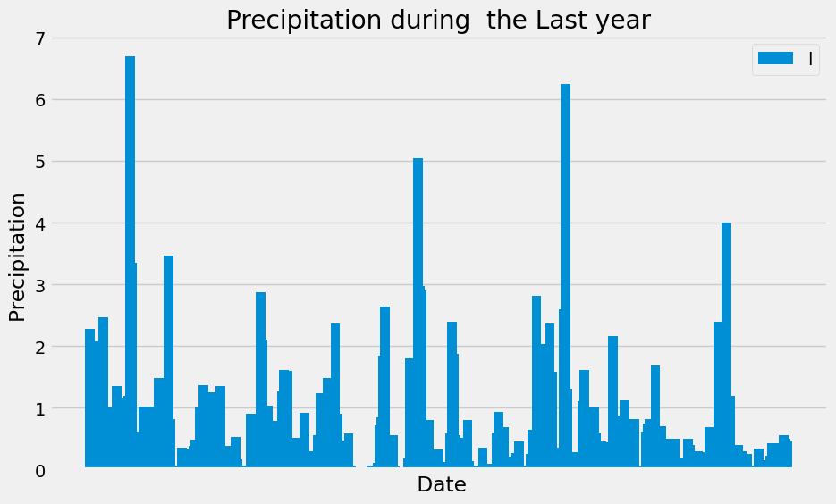
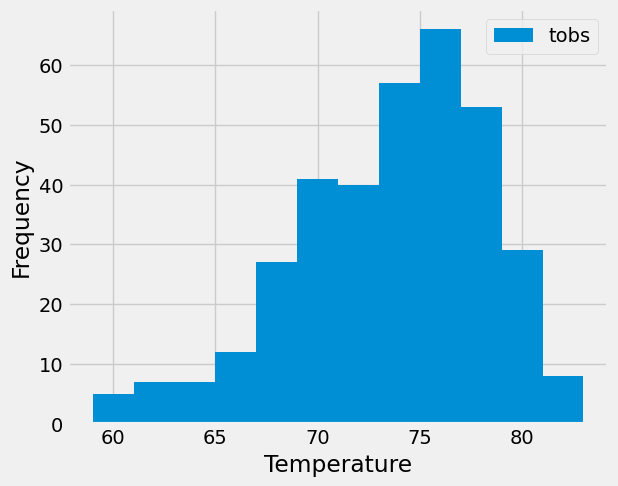

## Integrate with mytools - [ ] [Set up project integrations](https://git.bootcampcontent.com/Carleton-University/CARL-VIRT-DATA-PT-07-2023-U-LOLC/-/settings/integrations) 

# sqlalchemy-challenge
## Instructions
I've decided to treat myself to a long holiday vacation in Honolulu, Hawaii. To help with my trip planning, I decide to do a climate analysis of the area. The following sections outline the steps that I need to take to accomplish this task.

## Part 1: Analyze and Explore the Climate Data
In this section, I�ll use Python and SQLAlchemy to do a basic climate analysis and data exploration of myclimate database. Specifically, I will use SQLAlchemy ORM queries, Pandas, and Matplotlib. To do so, complete the following steps:

## use the provided files (climate_starter.ipynb and hawaii.sqlite) to complete myclimate analysis and data exploration.

## Use the SQLAlchemy create_engine() function to connect to mySQLite database.

## Use the SQLAlchemy automap_base() function to reflect mytables into classes, and then save references to the classes named station and measurement.

## Link Python to the database by creating a SQLAlchemy session.

## Perform a precipitation analysis and then a station analysis by completing the steps in the following two subsections.
['measurement', 'station']
# Precipitation Analysis
Find the most recent date in the dataset.

The most recent date in the data set is ('2017-08-23',)

## Using that date, get the previous 12 months of precipitation data by querying the previous 12 months of data.
#### Don�t pass the date as a variable to myquery.

## Select only the "date" and "prcp" values.

## Load the query results into a Pandas DataFrame. Explicitly set the column names.

## Sort the DataFrame values by "date".

## Plot the results by using the DataFrame plot method, 

## Use Pandas to print the summary statistics for the precipitation data.
count    2015.000000
mean        0.176462
std         0.460288
min         0.000000
25%         0.000000
50%         0.020000
75%         0.130000
max         6.700000
Name: Precipitation, dtype: float64
# Station Analysis
## Design a query to calculate the total number of stations in the dataset.
[(9,)]
## Design a query to find the most-active stations (that is, the stations that have the most rows). To do so, complete the following steps:

## List the stations and observation counts in descending order.
#### I will need to use the func.count function in myquery.

## Answer the following question: which station id has the greatest number of observations?
## Design a query that calculates the lowest, highest, and average temperatures that filters on the most-active station id found in the previous query.
[('USC00519281', 2772),
 ('USC00519397', 2724),
 ('USC00513117', 2709),
 ('USC00519523', 2669),
 ('USC00516128', 2612),
 ('USC00514830', 2202),
 ('USC00511918', 1979),
 ('USC00517948', 1372),
 ('USC00518838', 511)]
#### I will need to use functions such as func.min, func.max, and func.avg in myquery.
## Design a query to get the previous 12 months of temperature observation (TOBS) data. To do so, complete the following steps:

## Filter by the station that has the greatest number of observations.

## Query the previous 12 months of TOBS data for that station.
Text(0.5, 4.183333333333314, 'Temperature')
## Plot the results as a histogram with bins=12, 

# Part 2: Design myClimate App
Now that I have completed myinitial analysis, I will design a Flask API based on the queries that I just developed. To do so, use Flask to create myroutes as follows:

/

## Start at the homepage.

## List all the available routes.

## /api/v1.0/precipitation

## Convert the query results from myprecipitation analysis (i.e. retrieve only the last 12 months of data) to a dictionary using date as the key and prcp as the value.

## Return the JSON representation of mydictionary.

/api/v1.0/stations

## Return a JSON list of stations from the dataset.
/api/v1.0/tobs

## Query the dates and temperature observations of the most-active station for the previous year of data.

## Return a JSON list of temperature observations for the previous year.

/api/v1.0/<start> and /api/v1.0/<start>/<end>

## Return a JSON list of the minimum temperature, the average temperature, and the maximum temperature for a specified start or start-end range.

## For a specified start, calculate TMIN, TAVG, and TMAX for all the dates greater than or equal to the start date.

## For a specified start date and end date, calculate TMIN, TAVG, and TMAX for the dates from the start date to the end date, inclusive.
#### Hints
#### Join the station and measurement tables for some of the queries.

#### Use the Flask jsonify function to convert myAPI data to a valid JSON response object.
